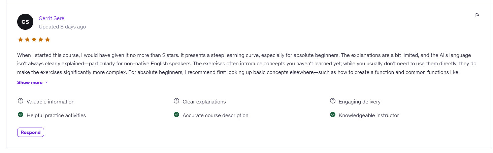

# Coding5s Gleam Creator Kit — Development Notes

Coding5s was created to make practical programming education accessible through short, repeatable exercises. The goal is not to replace official documentation, but to help learners develop enough confidence and familiarity to explore a programming language more deeply.

## Learning Gleam

For anyone comfortable learning in English, the best resource to start with is the official [Gleam Language Tour](https://tour.gleam.run/). It is fantastic, interactive, and the first place every new Gleam learner should visit.

Coding5s provides a complementary path based on repeated practice. Learning programming should be fun, and it can be even more enjoyable when the explanations and exercises are available in your own language.

## Generation, Distribution, and Accessibility

AI generation has a token cost, but that cost belongs primarily to creating the material, not distributing it.

A lesson can be generated once, stored, and later shared with 10 students or 1 million students without generating it again. This makes it possible to build reusable libraries of micro-exercises rather than requiring every learner to generate the same content independently.

These lessons are not limited to English. They can be generated in many languages supported by AI models. For lower-resource languages, a Language Seed Context can guide vocabulary, grammar, technical terminology, and culturally appropriate explanations.

This gives learners who do not know English an accessible entry point into programming and can prepare them to explore official documentation and other technical resources later.

AI also makes it possible to create many variations of the same concept: practice examples, debugging challenges, missing-code exercises, refactoring tasks, and extension activities. Quality still depends on clear generation rules, technical review, testing, and continuous improvement.

## The Five Learning Stages

Coding5s teaches each concept through five forms of active work:

1. **Practice:** Type and execute focused examples.
2. **Debug:** Repair intentionally broken code.
3. **Complete:** Write the missing code inside guided `TODO` sections.
4. **Refactor:** Improve working but weak implementations.
5. **Extend:** Add new behavior to existing code.

This process is different from traditional passive tutorials and may feel unusual at first. Its purpose is to gradually move the learner from following examples to diagnosing, completing, improving, and independently extending code.

A learner’s experience with a course using Coding5s in Udemy:

## Recent Improvements

The Gleam Creator Kit has received a complete curriculum and generation-rules review.

* Lessons were reordered so foundational syntax appears before dependent concepts.
* Type checking and debug output now appear near the beginning of the curriculum.
* Obsolete debug usage was replaced with Gleam’s `echo` keyword and appropriate `gleam/io` functions.
* Generation rules were tightened to reduce hallucinations and prevent unrelated or future concepts from appearing unnecessarily.
* Projects, debugging challenges, completion exercises, and mentors now follow the scope of the concept being studied.
* Representative generated lessons were reviewed for syntax, progression, expected output, and practical usability.

AI-assisted educational material improves through careful review and real learner feedback. Requesting feedback is part of that quality process; responsibility for evaluating and implementing it remains with the creator.

Coding5s will continue returning to the drawing board whenever a reproducible problem is found. The mission is to improve the system continuously and make useful programming practice available to learners who may not have access to premium courses, extensive technical libraries, or English-language education.

The Gleam Creator Kit will keep evolving in public.
